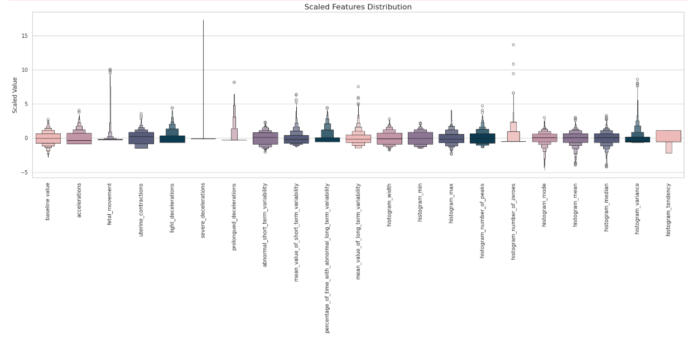
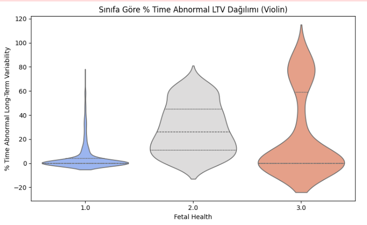
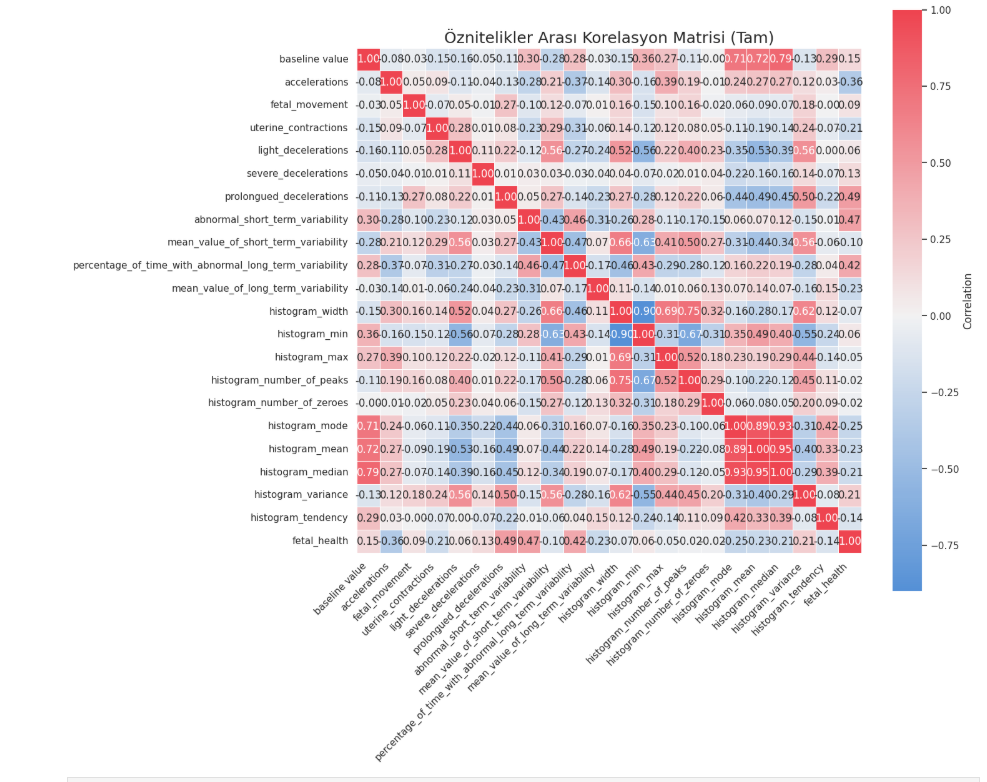
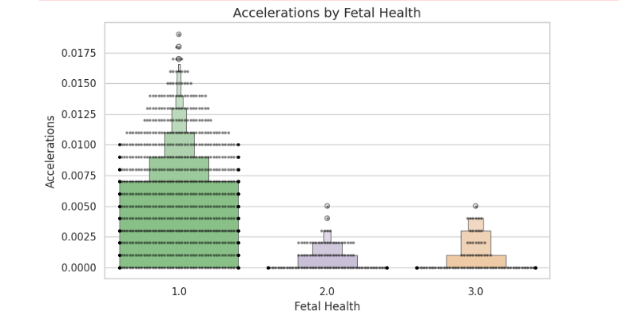
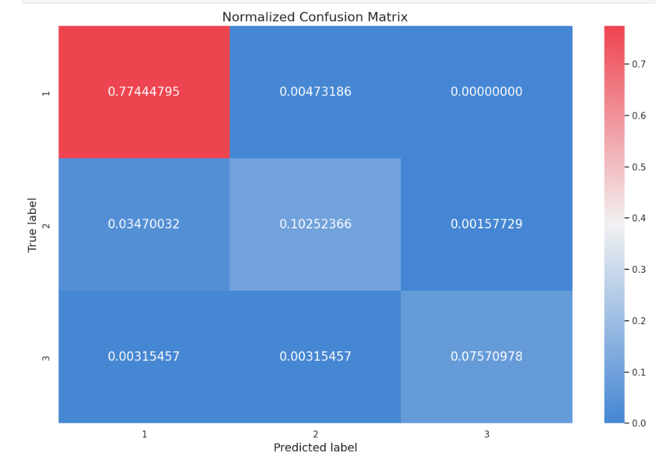
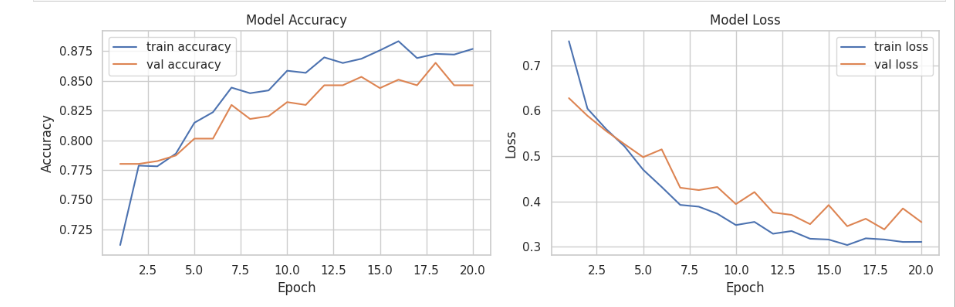
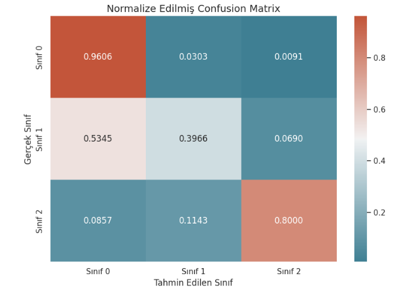
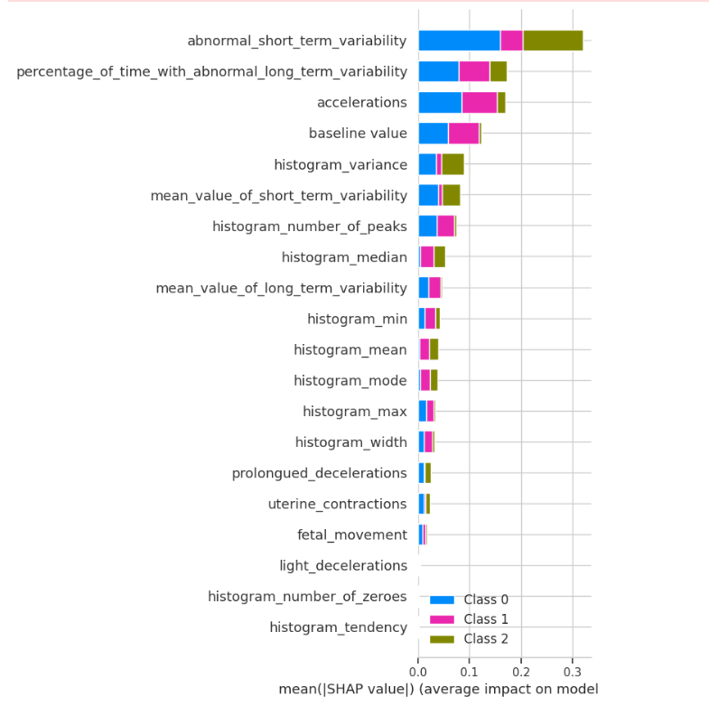

#  Fetal Health Classification Project

This project focuses on classifying fetal health status using cardiotocographic (CTG) data. We combined datasets, cleaned the data, performed exploratory data analysis (EDA), applied statistical tests, trained machine learning and deep learning models (Random Forest & LSTM), visualized model performance, interpreted model decisions using SHAP, and developed an interactive command-line prediction tool.

---

##  Dataset Preparation

We started by **merging two fetal health datasets** and removed duplicate entries to ensure data consistency.

This step allowed us to form a reliable dataset (`merged_dataset.csv`) for downstream analysis.

---

##  Clinical Context – Non-Stress Test (NST)
The Non-Stress Test (NST) is a commonly used non-invasive prenatal test to assess fetal well-being, particularly in the third trimester. It is based on monitoring the fetal heart rate (FHR) and its response to fetal movements.

##  How it works:
- The test records fetal heart rate over 20–40 minutes using cardiotocography (CTG).

- The goal is to observe accelerations — temporary increases in FHR associated with fetal movement.

- The test is called “non-stress” because no external stress (like uterine contractions) is applied.

##  What’s considered a "reactive" (normal) NST?
A reactive NST typically includes:

- 2 or more accelerations of at least 15 bpm lasting 15 seconds within a 20-minute period.

- A normal baseline FHR (110–160 bpm).

- Absence of prolonged decelerations or abnormal variability.

## Why is this important?
- Lack of accelerations may indicate fetal hypoxia, neurological depression, or sleep cycles.

- Features like accelerations, fetal_movement, baseline value, and variability metrics in our dataset are directly derived from NST observations.

- Therefore, many features used in this model are clinically significant indicators of fetal health.


##  Feature Description

The dataset contains 21 numerical input features derived from CTG signals and one target variable indicating fetal health condition.

| Feature Name                                          | Description                                  |
|-------------------------------------------------------|----------------------------------------------|
| `baseline value`                                      | Baseline fetal heart rate                    |
| `accelerations`                                       | Acceleration events in fetal heart rate      |
| `fetal_movement`                                      | Number of fetal movements                    |
| `uterine_contractions`                                | Uterine contractions                         |
| `light_decelerations`                                 | Light decelerations in heart rate            |
| `severe_decelerations`                                | Severe decelerations                         |
| `prolongued_decelerations`                            | Long-lasting decelerations                   |
| `abnormal_short_term_variability`                     | Binary: abnormal short-term variability      |
| `mean_value_of_short_term_variability`                | Mean of short-term variability               |
| `percentage_of_time_with_abnormal_long_term_variability` | Percentage of abnormal long-term variability |
| `mean_value_of_long_term_variability`                 | Mean of long-term variability                |
| `histogram_*` features                                | Various statistical features of heart rate histogram |
| `fetal_health` (target)                               | 1 = Normal, 2 = Suspect, 3 = Pathological     |

---

##  Exploratory Data Analysis (EDA)

### 0. Scaled Feature Distributions – Boxen Plot

Before model training, we standardized all features to have zero mean and unit variance. The plot below shows the distribution of scaled values for each feature.



**Observations:**
- Some features like `severe_decelerations`, `fetal_movement`, and `histogram_number_of_zeroes` have significant outliers.
- Most features are symmetrically distributed and centered around 0, which indicates effective standard scaling.
- `histogram_tendency` shows a strong negative bias and may require special attention.

### 1. Violin Plot – % Abnormal Long-Term Variability by Class



This violin plot shows the distribution of `% Time Abnormal Long-Term Variability` across fetal health classes:
- **Class 1 (Normal):** Values are clustered near zero.
- **Class 2 (Suspect):** Shows a broad spread of variability.
- **Class 3 (Pathological):** Displays a wider range and higher values.

---

### 2. Correlation Heatmap



The correlation matrix reveals:
- Strong inter-correlations between `histogram_median`, `mode`, and `mean`.
- Weak direct correlation between most features and `fetal_health`, suggesting the need for multivariate modeling.

---

### 3. Boxen Plot – Accelerations by Class



This plot illustrates that:
- **Class 1 (Normal)** has significantly higher accelerations.
- **Class 2 and 3** show minimal acceleration, indicating its potential as a key predictive feature.

---

##  Statistical Analysis

- **Spearman Correlation:**  
  - ρ = 0.0104, p = 0.6316 → No significant relationship between features tested.

- **Kruskal-Wallis Test on Fetal Movement:**  
  - Statistic = 26.97, p = 0.0000 → Significant difference between fetal health classes.

These tests validate feature relevance for classification.

---

##  Machine Learning – Random Forest

We trained and evaluated multiple models with 10-fold cross-validation and a separate test set. The best model was **Random Forest**.

### Accuracy Comparison

| Model                   | CV Accuracy | Test Accuracy |
|------------------------|-------------|----------------|
| Logistic Regression     | 0.889       | 0.894          |
| Decision Tree           | 0.914       | 0.926          |
| SVM                     | 0.906       | 0.910          |
| **Random Forest**       | **0.934**   | **0.948**      |

### Classification Metrics

| Metric     | Value   |
|------------|---------|
| Accuracy   | 0.9527  |
| Precision  | 0.9521  |
| Recall     | 0.9527  |
| F1 Score   | 0.9505  |

### Confusion Matrix



- **Class 1 (Normal)** is classified with highest accuracy.
- Minor confusion between **Class 2 (Suspect)** and others.

---

## Deep Learning – LSTM Model

We reshaped the dataset to sequences of shape `(n_features, 1)` and trained an LSTM model using TensorFlow.

### Training Curves (40 Epochs)



- Validation accuracy reached ~87%.
- Loss decreased consistently for both training and validation sets.

### Confusion Matrix – LSTM



- Excellent accuracy for **Class 0 (Normal)** and **Class 2 (Pathological)**.
- High misclassification in **Class 1 (Suspect)**.

### Classification Report

| Class    | Precision | Recall | F1-score | Support |
|----------|-----------|--------|----------|---------|
| Normal   | 0.9031    | 0.9606 | 0.9310   | 330     |
| Suspect  | 0.6216    | 0.3966 | 0.4842   | 58      |
| Patholog.| 0.8000    | 0.8000 | 0.8000   | 35      |
| **Accuracy** | **0.8700** |        |          |         |

---

##  Explainable AI – SHAP Analysis

To understand model decisions, we used SHAP to interpret feature importance in the Random Forest classifier.



Key insights:
- `abnormal_short_term_variability` and `percentage_of_time_with_abnormal_long_term_variability` are the most impactful features across all classes.
- SHAP values provide class-specific feature contributions, adding transparency to the model.

---

##  Interactive Prediction Tool

We built a command-line prediction interface using the trained Random Forest model.

### How It Works:
We developed a Python-based interactive prediction interface that allows the user to manually input all features and get an instant fetal health classification.

The trained RandomForestClassifier model is used to predict the fetal condition.

The user is prompted in the terminal to input all 21 features one by one.

Inputs are collected, reshaped into a NumPy array, and passed to the model.

The model outputs a class label: 1 (healthy), 2 (suspect), or 3 (pathological).

The label is mapped to a readable explanation.
##  Backend Logic (Code Summary)
```python
# 1. Load data and train RandomForest
df = pd.read_csv('merged_dataset.csv')
X = df.drop(columns=['fetal_health'])
y = df['fetal_health']

# 2. Train-test split
X_train, X_test, y_train, y_test = train_test_split(
    X, y, test_size=0.3, random_state=42, stratify=y
)

# 3. Train model
model = RandomForestClassifier(random_state=42)
model.fit(X_train, y_train)

# 4. Get user input for all features
feature_names = X.columns.tolist()
user_vals = [float(input(f"{feat}: ")) for feat in feature_names]
user_array = np.array(user_vals).reshape(1, -1)

# 5. Predict and interpret
pred = int(model.predict(user_array)[0])
mapping = {1: "healthy", 2: "suspect", 3: "pathological"}
print(f"Predicted class: {pred} → {mapping[pred]}")
```
##  Sample Interaction
```python
Please enter values for the following features:
  baseline value: 123
  accelerations: 0.003
  ...
== Prediction Result ==
  Class label: 2
  Explanation : suspect
```

##  Conclusion 

This project demonstrates how CTG data can be used to classify fetal health using machine learning and deep learning models. Key findings include:

- Random Forest outperformed all other models with ~95% accuracy.

- LSTM provided comparable results and potential for time-series improvements.

- SHAP analysis added model transparency.

- Interactive tool enables real-time prediction scenarios.
